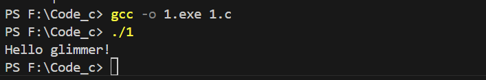

### 第一个程序

1. 高级语言如 $python$ 实现功能更容易，更好理解，低级语言建立在硬件基础上,速度快，但对于人类不好阅读与理解

   我更喜欢高级语言，方便易懂，不懂还可以查相关资料，可以引入丰富库文件，拿汇编语言写项目是很折磨的事情

2. ```cpp
   #include <stdio.h> // 引入stdio头文件,引入printf函数
   
   int main() { // 主函数
       printf("Hello, world!"); // 输出 
       return 0;// 函数返回0，表示程序正常进行
   }
   ```

3. ```return 0;``` 删除后不影响,主函数默认返回0

4. $int$储存整形(是有正负的整数) 

   $c$语言标准中$main$函数类型应该是$int$,用来表示程序运行的结果，可以在程序错误不同地方返回不同值，方便看哪里出错了

5. ```cpp
   #include <stdio.h>
   
   int main() {
       printf("Hello, world!");
       return 0;
   }
   ```

   

## 基础语法应用

修改内容在注释里

```cpp
#include <stdio.h> // cstdio 是c++的库

int main() { // main
    int code; // short范围不够
    for(;1;){//鬼畜的写法
		printf("Show me your code,please.");
        scanf("%d",&code);// &
        // 用与
        if(code >= 100000 && code <= 999999){
            printf("I am super hacker!");
            return 0;
        }// 多行用括号括起来
        else printf("Fake code!");
        // 字符串用双引号
    }
    return 0;
}
```

## 课后题

```c
#include <stdio.h> 

int a, b;
// 辗转相除法 复杂度logn
int gcd(int x,int y){
    if(y==0) return x;
    return gcd(y,x%y);
}

int main() { 
    scanf("%d%d",&a,&b);
    printf("%d",gcd(a,b));
    return 0;
}
```

